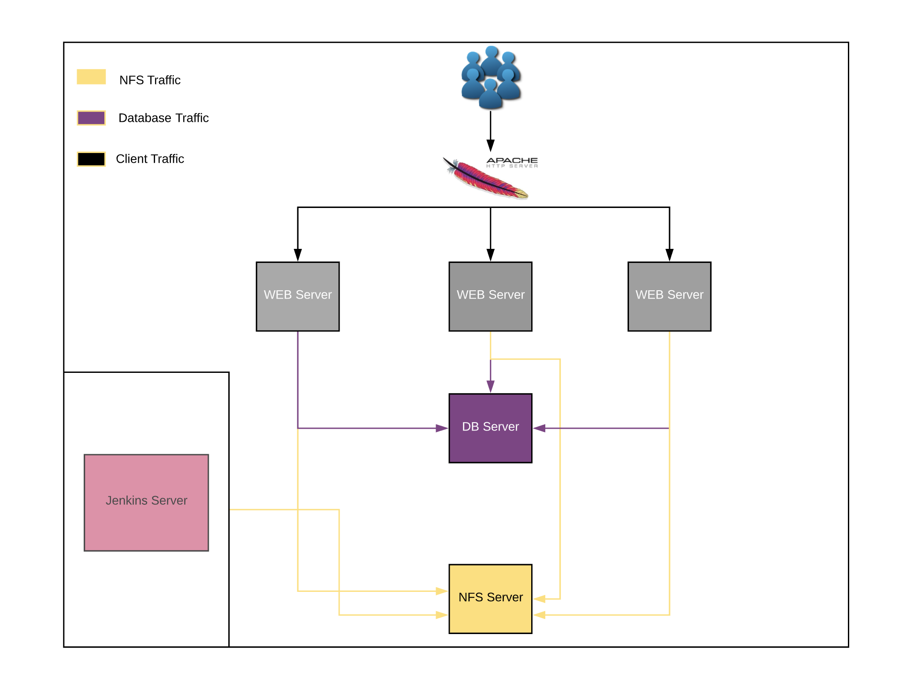

<h1 align="center">Welcome to Continous Integration Pipeline For Tooling Website 👋</h1>

  

> DevOps is about Agility, and speedy release of software and web solutions. One of the ways to guaranty this is Automation. DevOps practice and its tools eliminates a lot of manual work. Although we are not yet ready to start automating end to end, but in this project, you will begin to get a feel of DevOps practice uses Continous Integration to enable fast release of software and agility. In this project, you I am required to implement CI for Tooling Website using Jenkins.
> 
> 
> [Checkout the project notes.](Project-Notes.md)

### 🏠 [Homepage](https://github.com/dinulhaque/ci-pipeline-for-tooling-web)

## Author

👤 **Dinul Haque**

* Website: https://github.com/dinulhaque/
* Github: [@dinulhaque](https://github.com/dinulhaque)
* LinkedIn: [@https:\/\/www.linkedin.com\/in\/dinul-haque-aws-linux-sysadmin\/](https://linkedin.com/in/https:\/\/www.linkedin.com\/in\/dinul-haque-aws-linux-sysadmin\/)

## Show your support

Give a ⭐️ if this project helped you!

***
_This is my project experience, created with ❤️ by Dinul Haque(https://github.com/kefranabg/readme-md-generator)_